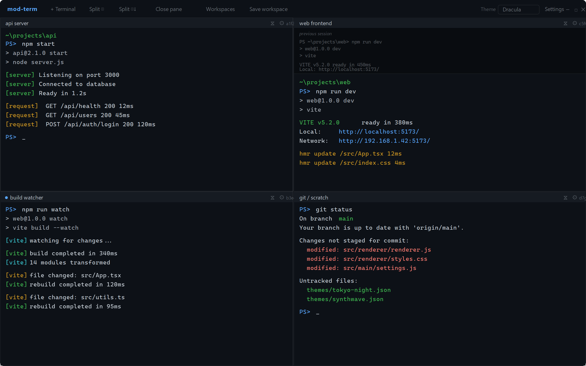

# mod-term

**A tiling terminal multiplexer for Windows — like `tmux`, but arrangeable, themeable, and able to pick up where you left off.**

mod-term lets you run many real Windows shells (PowerShell / cmd) side by side in one window, tile and resize them however you like, theme them, and — most importantly — save the whole arrangement as a named **workspace** so you can reopen every project's terminals at once instead of hunting them down one by one.

> Status: **runnable scaffold / MVP skeleton.** The tiling, theming, real-shell wiring, and workspace save/restore round-trip all work. Several affordances are stubbed and marked as roadmap items below.


*Rendered mockup — not an actual screenshot. Shows a 4-pane layout with an API server, web frontend (with scrollback from a previous session), a build watcher (with an activity indicator), and a git pane.*

---

## Why this exists

The pain point: you work on many projects at once. Every day you reopen each project's terminal by hand, `cd` into the right folder, start the dev server, start Claude, and so on — and sometimes you forget one. mod-term makes that a single action: save the arrangement once, restore it whenever.

---

## The stack (and why)

**Electron + xterm.js + node-pty + a custom tiling layer.**

| Layer | Choice | Why |
|---|---|---|
| App shell | **Electron** | Gives us a Node.js process (needed for real PTYs) plus a Chromium renderer (needed for a rich, draggable UI). |
| Terminal rendering | **xterm.js** (`@xterm/xterm`) | The battle-tested terminal emulator used by VS Code, Hyper, and Tabby. Handles ANSI, colors, selection, links, reflow. |
| Real shells | **node-pty** | Spawns actual Windows shells through **ConPTY**, Windows' native pseudo-console API. This is what makes the panes real terminals rather than fake consoles. |
| Tiling | **custom split-tree layout** | A small recursive layout model (`row`/`column` splits with draggable splitters) so panes are arrangeable, resizable, and serializable. |

### Why Electron and not Tauri

Tauri is usually the lighter, leaner choice for a desktop app, and for a **pure-UI** app it would likely win here too. But mod-term's core is not UI — it's **PTY/ConPTY integration**, and that is materially harder outside Electron:

- `node-pty` is a mature, prebuilt Node native addon that talks to Windows ConPTY cleanly. In Electron it runs directly in the main (Node) process — spawn a shell, pipe bytes, done.
- In Tauri, the backend is **Rust**, so you'd wire ConPTY yourself via a crate like `portable-pty`/`conpty`, manage the byte streams across the Rust↔webview bridge, and own more of the cross-platform edge cases. It's doable, but it's more work and more risk for the exact part that matters most here.
- Every proven app in this space — **VS Code's integrated terminal, Hyper, Tabby** — uses **xterm.js + node-pty**. Following that path means fewer unknowns.

So for *this* app specifically, Electron is the pragmatic pick. (If mod-term later wants a smaller footprint, the renderer/UI is deliberately decoupled from the pty layer, which would ease a future port.)

---

## Architecture

```
┌──────────────────────── Electron MAIN process (Node.js) ────────────────────────┐
│  src/main/main.js        – window, IPC, spawns one node-pty per pane             │
│  src/main/workspaces.js  – reads/writes workspaces.json in userData             │
│         │  node-pty  ⇄  PowerShell / cmd  (via Windows ConPTY)                   │
└─────────┼───────────────────────────────────────────────────────────────────────┘
          │  IPC (contextIsolation ON, tiny allow-listed API in src/preload.js)
┌─────────┼───────────────────────────── RENDERER (Chromium) ──────────────────────┐
│  src/renderer/renderer.js       – builds the tiling tree, split/close/resize/drag │
│  src/renderer/terminal-pane.js  – one xterm.js terminal ⇄ one pty                 │
│  src/renderer/theme.js          – loads /themes/*.json, applies CSS vars          │
│  src/common/layout.js           – the recursive split-tree model (shared shape)   │
└───────────────────────────────────────────────────────────────────────────────────┘
```

**Bytes flow:** `shell ⇄ node-pty (main) ⇄ IPC ⇄ xterm.js (renderer)`. The renderer has **no direct Node access** (contextIsolation on); it can only call the small named API exposed in `preload.js`. A terminal renders untrusted program output, so keeping that surface tiny is deliberate.

**The layout is a tree.** Each leaf is a pane (one shell); each branch is a `row` or `column` split with sizes. Because the tree *is* the data, saving a workspace is just serializing it — the arrangement round-trips to disk for free.

---

## Features

### 1. Tiling panes
Split the active pane horizontally or vertically, resize by dragging the splitter between panes (double-click a splitter to even them out), and **drag a pane's header** to rearrange. Drop on another pane's **center to swap**, or on its **edge to split** there — a live blue indicator shows where the pane will land. Move focus between panes with `Ctrl+Alt+Arrow`, and **zoom/maximize** the active pane with `Ctrl+Shift+Z` (or double-click its header). The active pane is highlighted with an accent border. Each pane hosts a real shell via node-pty.

### 2. Themes (data-driven)
Themes are **JSON files** in `/themes`, not code. Each defines UI chrome colors, the 16 ANSI terminal colors, and font settings. **Dark is the default** and there's no white flash on launch. Three dark themes ship (dark, One Dark, Dracula). To add one: drop a `.json` file in `/themes` and list it in `themes/index.json` — no code changes. Pick a theme from the toolbar or in Settings; your choice persists.

### 3. Workspaces / session persistence — the key feature
Save the current arrangement as a named workspace. A workspace captures the **full pane layout**, each pane's **working directory**, and an optional **startup command** per pane. On launch, mod-term offers to restore your last workspace (or does it silently if you enable "restore on launch" in Settings) so all your project terminals reopen in their arrangement, each `cd`'d into the right project, optionally auto-running a command like `npm run dev` or `claude`.

### 4. Workspace quick-switcher
`Ctrl+P` opens a fuzzy switcher to jump between saved project setups.

### 5. Settings
`Ctrl+,` opens Settings: default theme, terminal font size, default shell, and "restore last workspace on launch". The shell picker auto-detects available shells on your system (PowerShell 7, Windows PowerShell, Command Prompt, Git Bash, WSL) and prefers PowerShell 7 (`pwsh`) when available. Settings persist to disk (`settings.json` in userData) and apply live.

---

## "Pick up where you left off" — the honest version

This is the headline feature, so here is exactly what it does and does **not** do.

**It cannot** freeze a live running process and thaw it later. There is no OS mechanism to snapshot a running `npm run dev` (with its open sockets, child processes, and in-memory state) and resume it byte-for-byte. Anyone who claims a terminal app does this is really doing what's below.

**It does** restore, exactly like [`tmuxinator`](https://github.com/tmuxinator/tmuxinator) / [Terminator layouts] / VS Code's window restore:

1. **Layout** — the full split arrangement and pane sizes.
2. **Working directory** — each pane spawns its shell in its saved folder.
3. **Startup command** — each pane optionally re-runs a configured command (`npm run dev`, `claude`, `git status`, …).

So "pick up where you left off" means **your environment is reconstructed and your commands are re-run**, not that running processes are resurrected. Scrollback history from the previous session is also not restored. This is the honest, achievable definition — and it's designed that way on purpose. It's what actually removes the daily pain: you get every project's terminals back, in place, in their folders, with their servers starting up, in one action.

**Where it's stored:** at runtime the real file lives in Electron's `userData` directory:
`%APPDATA%\mod-term\workspaces.json` on Windows. See `workspaces.example.json` in this repo for the exact shape.

**Capturing the *real* cwd (shell integration / OSC 7).** When you save a workspace, mod-term stores each pane's *current* working directory — not just where the pane started — provided the shell reports it via the standard **OSC 7** escape sequence (`ESC ] 7 ; file://HOST/PATH BEL`). If the shell doesn't emit OSC 7, the pane falls back to its configured/starting directory (never wrong, just less fresh). To enable it in PowerShell, add this to your `$PROFILE`:

```powershell
function Prompt {
  $p = (Get-Location).Path
  $u = [Uri]::EscapeUriString(($p -replace '\\','/'))
  $Host.UI.Write("`e]7;file://${env:COMPUTERNAME}/$u`a")
  "PS $p> "
}
```

(Windows Terminal ships a similar snippet; any shell integration that emits OSC 7 works.) This is exactly how VS Code and Windows Terminal track cwd.

---

## Project structure

```
mod-term/
├─ package.json                 # deps (electron, xterm, node-pty), start/dist scripts
├─ README.md
├─ .gitignore
├─ workspaces.example.json      # example of a saved workspace (the real one lives in userData)
├─ themes/
│  ├─ index.json                # lists available themes; sets default = dark
│  ├─ dark.json                 # default dark theme
│  ├─ one-dark.json             # Atom One Dark
│  ├─ dracula.json              # Dracula
│  ├─ tokyo-night.json          # Tokyo Night
│  ├─ catppuccin-mocha.json     # Catppuccin Mocha
│  ├─ nord.json                 # Nord
│  ├─ gruvbox-dark.json         # Gruvbox Dark
│  └─ synthwave.json            # Synthwave '84
└─ src/
   ├─ preload.js                # tiny allow-listed IPC bridge (contextIsolation)
   ├─ main/
   │  ├─ main.js                # window + IPC + spawns node-pty per pane
   │  ├─ workspaces.js          # workspace load/save/list/delete on disk
   │  └─ settings.js            # app settings (restore-on-launch, defaults) on disk
   ├─ common/
   │  └─ layout.js              # recursive split-tree model (shared shape)
   └─ renderer/
      ├─ index.html             # loads xterm + our renderer
      ├─ styles.css             # dark-first UI; colors come from theme CSS vars
      ├─ renderer.js            # tiling, split/close/resize/drag/zoom, focus nav, workspaces
      ├─ terminal-pane.js       # one xterm terminal wired to one pty; OSC 7 cwd + title
      ├─ theme.js               # loads/applies data-driven themes
      └─ dialogs.js             # dark-themed modal confirm/prompt/form (no browser popups)
```

---

## Running it on your Windows PC

### Quick install (recommended)

Download the latest **mod-term Setup x.x.x.exe** from the [Releases](https://github.com/ToxicOrca/mod-term/releases) page and run it. That's it — no build tools or Node.js needed.

> The installer is unsigned, so Windows SmartScreen may prompt you to allow it.

### Building from source

> **This must be run on Windows.** node-pty compiles a native binary against Windows' ConPTY; it can't run in a Linux sandbox, which is why the code here is scaffolded rather than pre-built.

**Prerequisites**

- **Node.js LTS** (18 or 20) — https://nodejs.org
- **Build tools for the native module.** node-pty needs a C++ toolchain. Easiest options:
  - Install **Visual Studio Build Tools** with the "Desktop development with C++" workload, **or**
  - the older `npm install --global windows-build-tools` (deprecated but still works on some setups).
  - Often node-pty ships **prebuilt binaries** and no compilation is needed — try the install first and only install build tools if it fails.

**Commands** (run in the `mod-term` folder in PowerShell):

```powershell
npm install        # installs deps; postinstall runs electron-rebuild for node-pty
npm start          # launches mod-term
```

If node-pty fails to load at startup, rebuild it against Electron's Node version:

```powershell
npm run rebuild    # = npx electron-rebuild -f -w node-pty
```

To package a distributable later:

```powershell
npm run dist       # electron-builder -> Windows installer in dist/
```

**What you'll see on first run:** two side-by-side PowerShell panes (proving the tiling), a dark theme, a theme picker, and Split / Close / Save workspace / Workspaces / Settings controls. Save a workspace, restart, and accept the restore prompt to see persistence work.

**Shortcuts**

| Action | Keys |
|---|---|
| New terminal | `Ctrl+Shift+T` |
| Split side-by-side | `Ctrl+Shift+D` |
| Split stacked | `Ctrl+Shift+E` |
| Close active pane | `Ctrl+Shift+W` |
| Zoom / maximize active pane | `Ctrl+Shift+Z` (or double-click header) |
| Move focus between panes | `Ctrl+Alt+←↑↓→` |
| Rearrange by dragging | drag a pane header to an edge of another pane |
| Rename a terminal | double-click the title text in a pane header |
| Even out a split | double-click the splitter |
| Workspace quick-switcher | `Ctrl+P` |
| Save workspace | `Ctrl+S` |
| Settings | `Ctrl+,` |

---

## Roadmap

**Done**
- [x] Electron shell, dark-first, no white flash
- [x] Real shells via node-pty piped to xterm.js; resize → pty resize; exit handling; many concurrent ptys
- [x] Tiling: split H/V, resize via splitters (double-click to even), collapse-on-close, robust split-tree
- [x] Drag to rearrange: drop-on-center swaps, drop-on-edge splits, with live drop indicator
- [x] Directional focus navigation (`Ctrl+Alt+Arrow`) + active-pane highlight
- [x] Pane zoom/maximize (`Ctrl+Shift+Z`)
- [x] Data-driven themes (4 shipped) + picker, dark default, choice persists
- [x] Workspace save/load/list + restore last (prompt, or silent via setting)
- [x] Quick-switcher (`Ctrl+P`)
- [x] Live cwd tracking via OSC 7 so saves capture the real folder + pane titles from OSC 0/2
- [x] Settings UI (theme, font size, default shell, restore-on-launch) persisted to disk
- [x] In-app dark modals (no browser confirm/prompt)

**Toward full**
- [ ] Per-pane editor for cwd / shell / startup command from the UI (currently: live-tracked + editable via saved JSON)
- [ ] Delete/rename workspaces from the switcher (IPC already exists: `workspaces:delete`)
- [ ] Tabs: multiple workspaces open at once
- [ ] Persist scrollback buffer snapshot per pane (best-effort, not process state)
- [ ] Broadcast input to multiple panes (tmux "synchronize-panes")
- [ ] Command palette; per-pane manual rename
- [ ] Configurable keybindings; cursor style setting
- [ ] Packaged signed installer + auto-update

---

## License

[MIT](LICENSE)
